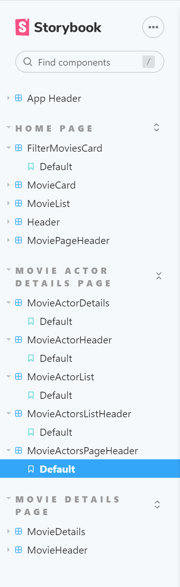
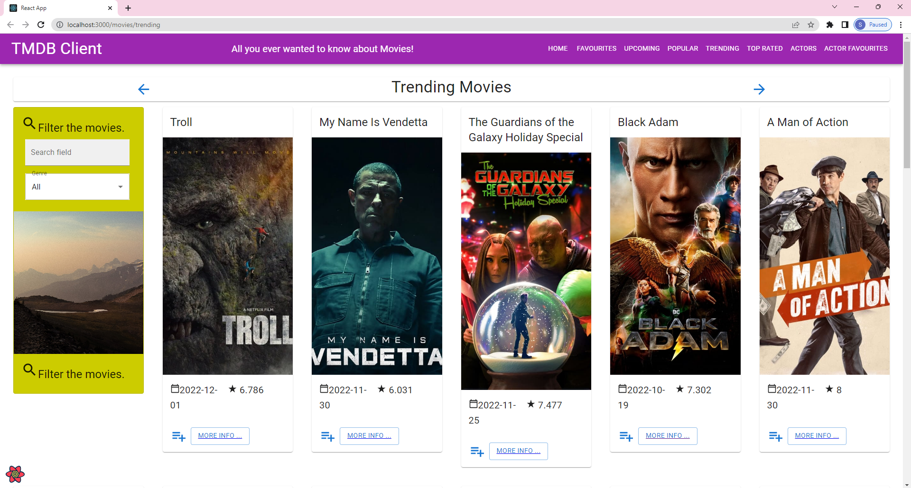
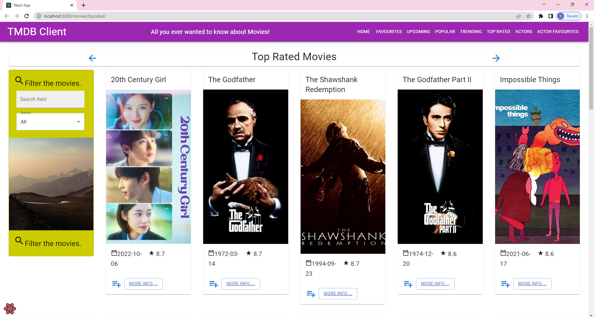
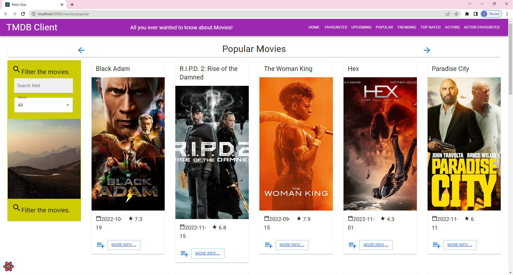
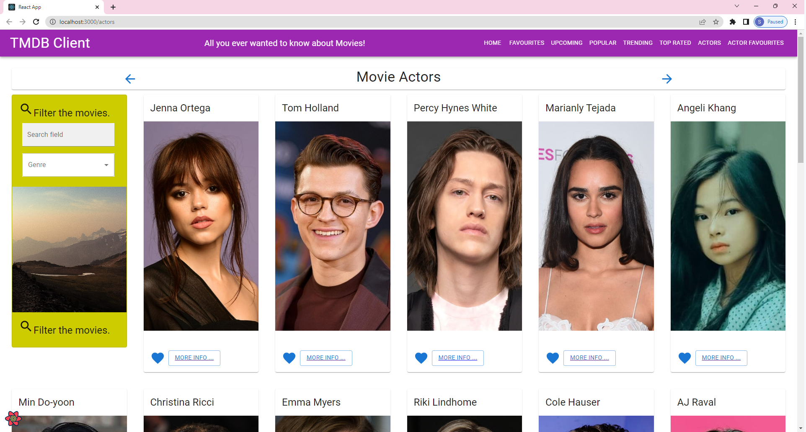
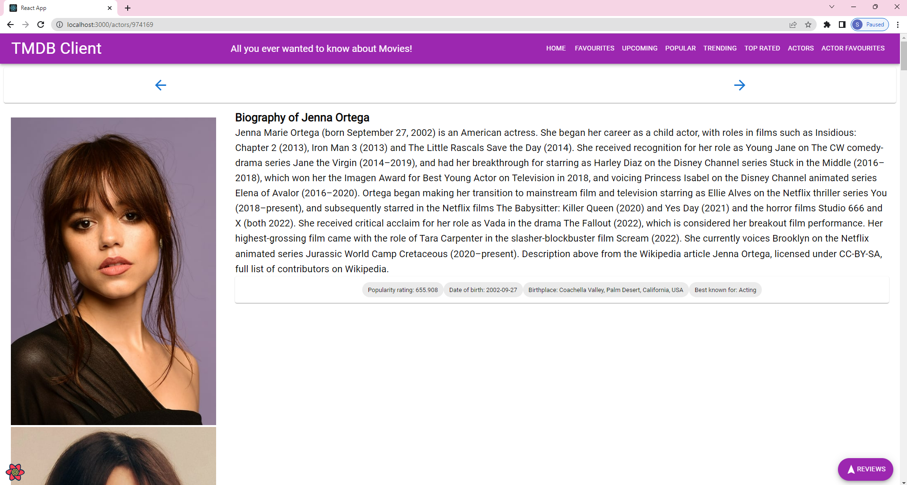
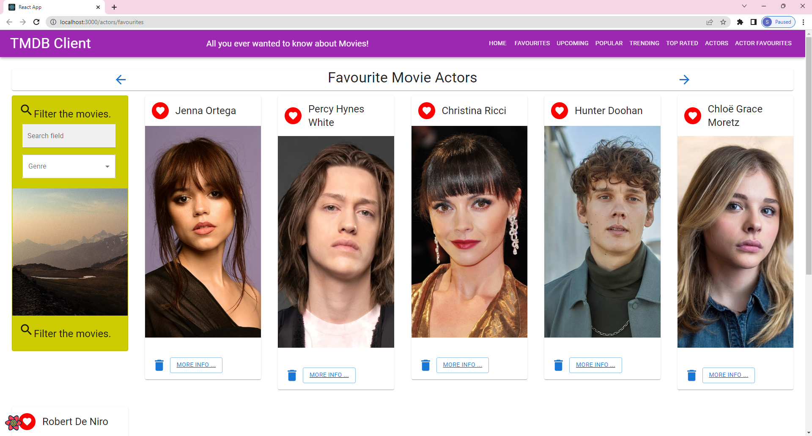
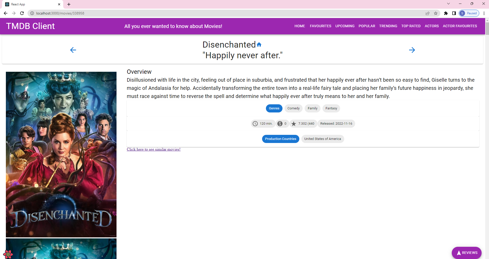
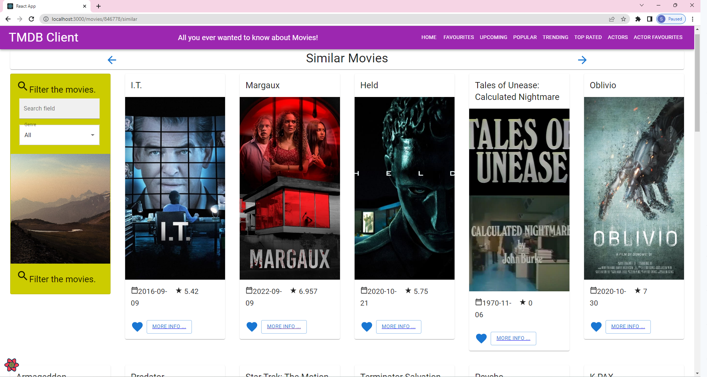

# Web App Dev 2 - Assignment 1 - ReactJS app.

Name: Saoirse O'Donovan

## Overview.

Used the React framework to design and develop an extension of the Movies Fan app that was created within the labs. 

### New Pages.

[ Provide a bullet-point list of the new pages you added to the Movies Fan add (include modifications to existing pages).]

+ List of Trending movies.
+ List of Popular movies.
+ List of Top Rated movies.
+ List of Actors
+ List of Favourite Actors.
+ (Modified) Movie Details page - added button for Similar movies.
+ Details view of Actor biographies - added chips with various data.

### New Features.

[ Provide a bullet-point list of the __new features__ you added to the Movies Fan app.] 

+ Button on the Movie Details Page that will show similar movies - additional parameterized URL and data hyperlinking.
+ 'More Info' button on the Actors Cards that will show Actors biography - additional parameterized URL and data hyperlinking.
+ New data entity added - Actors.
+ Storybook support.
+ Added filtering by Actor name. 
+ Caching support.
+ New pages/views.

## Setup requirements.

[ Outline any non-standard setup steps necessary to run your app locally after cloning the repo.]

npm install

## TMDB endpoints.

[ List the __additional__ TMDB endpoints used, giving the description and pathname for each one.] 

+ /movie/popular - Popular movies.
+ /movie/top_rated - Top rated movies.
+ /movie/trending - Trending movies.
+ /movie/${id}/similar - Similar movies.
+ /person/${id}/images - Movie actor images. 
+ /person/${id} - Movie actor details. 
+ /person/popular - Getting popular actors.
+ /person/${id} - Get actor.

## App Design.

### Component catalogue.

>Below is a screenshot of the Storybook UI, I have added all of the sections under the 'Movie Actor Details Page' heading. 

The new stories are:
+ MovieActorDetails
+ MovieActorHeader
+ MovieActorList
+ MovieActorListHeader
+ MovieActorsPageHeader

### UI Design.

[ Insert screenshots of the __new app pages__ you developed (including modified existing pages), Have an appropriate caption for each one (see example below).

>Shows a new view/page that displays movies that are currently trending. 

>Shows a new view/page that displays movies that are rated the highest.

>Shows a new view/page that displays movies that are most popular.

>Shows a new view/page that displays an added data model of actors that are popular.

>Shows a new details page that displays the biography of the actors listed on the actors page, this view is shown when the 'more info' button is clicked on within the actors card.

>Shows a new view/page that displays all of the actors that have been favourited - like how it was done in the labs with movies.

>On the movie details page, accessed when the 'more info' button is clicked in relation to one of the showing movies, I have added a button labelled 'Click here to see similiar movies!'.

>Shows a new view/page that displays similar movies to the movie that the user had selected.

### Routing.

[ List the __new routes__ supported by your app and state the associated page.]

e.g. 

+ /movies/upcoming - The upcoming movies list page.
+ /movies/popular - The popular movies list page.
+ /movies/toprated - The top rated movies list page.
+ /movies/trending - The trending movies list page.
+ /movies/:id/similar - The list of similar movies.
+ /actors/ - The actors list page.
+ /actors/:id - The actor details page showing actors biographies.
+ /actors/favourites - The page showing favourited actors.  

[If relevant, state what aspects of your app are protected/private (i.e. require authentication) and what is public.]

## Independent learning (If relevant).

[ Itemize the technologies/techniques you researched independently and adopted in your project, i.e. aspects not covered in the lectures/labs. Mention the source code filenames that illustrate these  (code excerpts are not required) and provide references to the online resources that helped you (articles/blogs).
